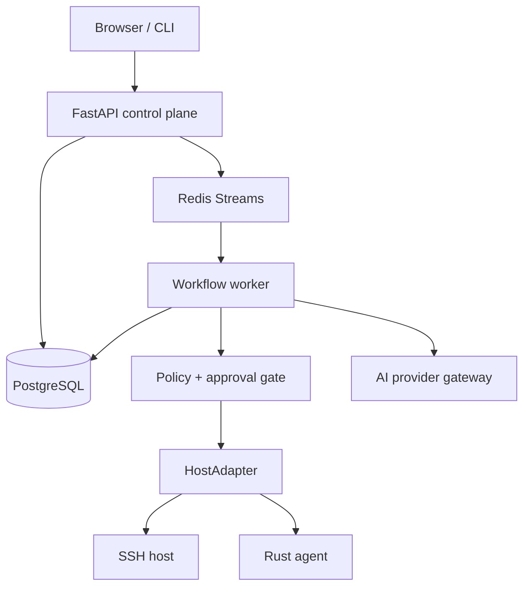

# InfraOps v0.1 Design Specification

**Status:** Approved for implementation planning

**Goal:** Build a self-hosted infrastructure control plane that safely investigates and remediates a Linux/Docker incident through structured tools, explicit policy, human approval, and a complete audit trail.

**Primary user journey:** A developer starts InfraOps with `infraops init`, completes the web setup wizard, connects a local demo host, starts a reproducible unhealthy-service scenario, reviews AI-correlated evidence, approves a typed remediation action, and sees verification plus the immutable audit timeline.

## 1. Scope and non-goals

### In scope for v0.1

- Hybrid CLI and web onboarding.
- Docker Compose deployment suitable for one workstation, VM, or VPS.
- PostgreSQL-backed durable state and Redis Streams for jobs/live events.
- Next.js/TypeScript dashboard focused on investigation and approvals.
- FastAPI control plane with typed REST APIs and OpenAPI documentation.
- A provider-neutral AI gateway with a deterministic local demo provider and one optional OpenAI-compatible provider adapter. Additional providers use the same interface and are staged for later milestones.
- A local, reproducible Docker lab with an unhealthy service and a safe recovery action.
- A common `HostAdapter` interface with a functional demo adapter and the first Rust agent protocol/agent implementation.
- Read-only evidence collection, structured action proposals, policy evaluation, approval, execution, verification, retries, cancellation, and audit events.
- Security documentation, threat model, CI, migrations, unit tests, API tests, Rust tests, and an end-to-end demo test.

### Explicitly out of scope for v0.1

- Arbitrary shell execution by a model, operator, or API caller.
- Production Kubernetes deployment or Helm charts.
- Reverse-engineered, unofficial, or invented OAuth flows.
- Autonomous mutation without an explicit policy and human approval.
- Full vulnerability scanning integrations, fleet monitoring, billing, multi-tenancy, or a marketplace.
- Supporting every listed model provider as a fully implemented adapter. The provider contract and registry are extensible; provider adapters are added incrementally.

## 2. Design principles

1. PostgreSQL is the source of truth for workflow state, approvals, action records, and audit events. Redis is a delivery mechanism, never the only copy of a security-relevant event.
2. Model output is untrusted data. It can request structured operations but cannot choose executable commands, access credentials, or bypass policy.
3. The same domain and policy services are used by the web UI, CLI, worker, SSH adapter, and Rust agent adapter. Clients do not duplicate business rules.
4. Every mutating operation is idempotent where possible, has a bounded timeout, records an execution attempt, and can be reconciled after a process restart.
5. The safe local demo is clearly labelled as synthetic/sandboxed. It exercises the same workflow interfaces as a real host.
6. Prefer a small number of well-defined processes over microservices without an operational reason.

## 3. Repository structure

```text
InfraOps/
├── apps/
│   └── dashboard/                 Next.js + TypeScript web application
├── services/
│   ├── control-plane/             FastAPI application and domain services
│   └── worker/                    durable job consumer and workflow runner
├── crates/
│   ├── infraops-agent/            outbound Linux host agent
│   ├── executor/                  typed action execution and adapters
│   ├── policy/                    Rust-side policy/protocol validation
│   └── protocol/                  serde types and wire message codecs
├── cli/                           Rust `infraops` CLI
├── packages/
│   └── schemas/                   JSON Schema contracts and generated fixtures
├── lab/
│   ├── docker/                    sandbox host and fault scenarios
│   └── scenarios/                 scenario manifests and expected outcomes
├── deploy/
│   ├── docker-compose/            official deployment files
│   └── kubernetes/                reserved for a later release
├── docs/
│   ├── architecture/
│   ├── security/
│   ├── threat-model/
│   └── demos/
└── .github/workflows/             CI, security checks, and release checks
```

The Python control plane owns business logic. Rust owns host-side execution, protocol validation, and the CLI. TypeScript consumes versioned API/schema contracts and never performs privileged host operations.

## 4. Runtime architecture



The dashboard and CLI call the control plane over authenticated HTTP. The API records a request and emits a job. The worker loads the current workflow version from PostgreSQL, performs the next allowed step, and persists the result in one transaction where possible. The worker publishes live progress events after durable state is written. The UI may miss a live event without losing the underlying timeline.

The Rust agent initiates an outbound TLS session to the control plane. A managed host does not need a public inbound port. SSH is an optional control-plane-to-host path for initial inventory and agent installation; it uses a fixed command registry and never interpolates user input into a shell command.

## 5. Processes and responsibilities

### Control plane

FastAPI exposes versioned REST endpoints for setup, authentication, providers, hosts, incidents, approvals, actions, and audit events. It validates Pydantic requests, authorizes the actor, persists durable domain state, and enqueues work. It does not run long-running host commands or call a model directly inside the request handler.

### Worker

The worker consumes Redis jobs with a consumer group, but treats the PostgreSQL job/workflow record as authoritative. Each job carries an idempotency key and expected workflow version. A stale or duplicated job is acknowledged without repeating a completed side effect. Retryable failures use bounded exponential backoff; non-retryable failures transition the incident to `ESCALATED` with a reason.

### Rust agent

The agent runs as a dedicated non-root systemd service on supported Linux hosts. It maintains an outbound session, reports heartbeats and inventory, receives only typed operations, validates the operation against its locally compiled capability registry, and returns structured results. Operations requiring privilege use narrowly scoped systemd/Polkit/sudo rules for named actions; the agent process does not receive an unrestricted root shell.

### CLI

The Rust CLI uses the control-plane API for business operations. `infraops init` is the local bootstrap exception: it creates the instance directory, generates the instance identifier and encryption material, writes a mode-0600 environment file, starts the Compose stack, waits for health checks, and prints a one-time setup URL/token. Commands such as `host add`, `incident list`, and `provider test` remain API calls.

### Dashboard

The dashboard provides Setup, Dashboard, Hosts, Incidents, Incident Investigation, Actions/Approvals, AI Providers, and Audit Log pages. The investigation page is the primary v0.1 surface: timeline, evidence cards, root-cause hypothesis, confidence, proposed action, policy result, approval control, execution result, and verification state.

## 6. Onboarding and configuration

`infraops init` creates a local instance configuration and starts the official Compose deployment. The terminal prints health status and a setup URL such as `https://localhost:8443/setup`. The one-time bootstrap token is exchanged only over the setup flow and is invalidated after administrator creation.

The web wizard has four steps:

1. **Instance:** instance name, administrator, deployment mode, TLS/base URL, and master-key status.
2. **AI providers:** provider type, endpoint, credential reference, model discovery, health check, and role routing. Credentials are written through the secrets broker; the browser never receives a stored secret after submission.
3. **Hosts:** register a demo host, add an SSH host, or enroll a Rust agent. Each host displays capabilities and connection health.
4. **Review:** show network exposure, enabled providers, configured hosts, and required next actions before completing setup.

Provider authentication is limited to documented methods. The UI presents API-key, custom OpenAI-compatible endpoint, local credential, or officially supported OAuth/device-code options only when the adapter declares them. No adapter may emulate a provider's private login flow.

## 7. Domain model and workflow

Core PostgreSQL entities:

- `instance`: immutable instance ID, name, schema version, and setup state.
- `users`: administrator/operator/viewer identity and role.
- `hosts`: display name, connection mode, capabilities, status, last heartbeat, and agent identity.
- `secret_refs`: encrypted credential records addressed by opaque IDs; raw values never appear in normal domain responses.
- `provider_configs`: provider kind, endpoint, model metadata, health status, and secret reference.
- `model_routes`: role-to-provider/model mapping with optional fallback.
- `incidents`: host, scenario, severity, state, workflow version, timestamps, and resolution.
- `evidence_items`: typed evidence kind, source, sanitized payload, collection status, and hash.
- `action_requests`: typed action, target, risk level, policy decision, expiry, and idempotency key.
- `approvals`: actor, decision, reason, re-authentication marker, and timestamp.
- `execution_attempts`: adapter, start/end time, result, sanitized output, and retry metadata.
- `audit_events`: append-only actor, model, action, target, decision, approval, result, duration, and correlation IDs.
- `jobs`: durable work item, status, attempts, due time, and workflow version.

Incident state transitions are explicit and validated:

```text
INCIDENT_CREATED → TRIAGE → COLLECT_EVIDENCE → ANALYZE
→ PROPOSE_REMEDIATION → WAITING_FOR_APPROVAL → EXECUTE
→ VERIFY → RESOLVED
                         ↘              ↘
                          ESCALATED      ESCALATED
```

Each transition appends an audit event and increments the workflow version. A process restart reloads the incident and resumes from the last committed state. An incident cannot jump directly from model output to execution.

## 8. Host abstraction and protocol

The control plane depends on a `HostAdapter` contract, not on SSH or agent details:

```text
capabilities(host_id) -> CapabilitySet
collect_evidence(host_id, EvidencePlan) -> EvidenceBundle
execute(host_id, ApprovedAction) -> ExecutionResult
verify(host_id, VerificationPlan) -> VerificationResult
```

Initial adapters:

- `DemoHostAdapter`: deterministic sandbox host used by the local lab and end-to-end tests.
- `SshHostAdapter`: uses a connection from the credential broker, fixed operation templates, bounded output, and allowlisted paths/commands.
- `AgentHostAdapter`: maps typed operations to the Rust agent session and rejects capabilities not advertised by that host.

Versioned JSON Schemas in `packages/schemas` define `AgentEnvelope`, `EvidenceItem`, `ActionRequest`, `ExecutionResult`, and `AuditEvent`. The Python models, Rust serde types, and TypeScript types are checked against fixture payloads in CI. Agent envelopes contain protocol version, message ID, host ID, timestamp, nonce, and typed payload. They do not contain prompts or provider credentials.

The first Rust agent protocol uses an outbound TLS WebSocket session with heartbeat, reconnect backoff, request IDs, and at-least-once delivery. Enrollment uses a one-time token to issue a host identity; subsequent sessions use a device certificate. Direct inbound agent control is reserved for a later release.

## 9. AI provider gateway and model routing

The gateway exposes one internal interface:

```text
authenticate()
list_models()
generate(request)
stream(request)
tool_call(request, allowed_tools)
health_check()
usage()
```

Provider adapters implement this interface and return normalized responses. The initial registry reserves adapters for OpenAI, official Codex authentication where available, Anthropic, Gemini, DeepSeek, OpenRouter, Ollama, and generic OpenAI-compatible endpoints. v0.1 ships a deterministic local demo provider and one generic OpenAI-compatible adapter; other entries fail closed with a clear `not_enabled` status until implemented and tested.

Model roles are persisted independently from providers:

```yaml
models:
  planner: provider/model
  investigator: provider/model
  security: provider/model
  summarizer: provider/model
  fast_tasks: provider/model
  fallback: provider/model
```

The planner, investigator, operator, and verifier exchange structured workflow objects. They do not communicate through uncontrolled natural-language loops. Prompts include sanitized evidence and opaque host/secret identifiers only. Every AI operation records provider, model, latency, usage, fallback, and correlation ID, but never stores raw credentials.

## 10. Structured tools and policy

The model may request only a named tool from a versioned registry, for example:

```json
{
  "action": "service.restart",
  "host_id": "server-01",
  "target": {"service": "nginx"},
  "reason": "service health check failed",
  "idempotency_key": "..."
}
```

The tool gateway validates schema, host capability, target ownership, expiration, and actor context before policy evaluation. The executor receives the approved structured action and resolves credentials internally. It never accepts a raw command string from the model or browser.

Risk classes:

| Class | Example | Default behavior |
| --- | --- | --- |
| `READ_ONLY` | service state, logs, CPU, memory, ports | allowed if host access is valid |
| `LOW_RISK` | bounded diagnostic probe | allowed only by configured rule |
| `MUTATING` | restart service/container, change config | human approval required |
| `HIGH_RISK` | privilege, firewall, destructive storage/network action | explicit approval plus elevated confirmation |
| `FORBIDDEN` | arbitrary shell, credential export, policy bypass | always rejected |

Policy decisions are persisted with rule ID, risk, reason, and policy version. Approval is bound to the exact action hash and expires if the action, target, or evidence version changes.

## 11. Secrets, trust boundaries, and privilege

Trust boundaries are documented in `docs/threat-model/README.md` and enforced in code:

1. Browser/CLI to API: authenticated user boundary; all input is untrusted.
2. API/worker to model provider: external provider boundary; prompts are sanitized and credentials are attached only inside the gateway.
3. Model to tool gateway: untrusted model-output boundary; JSON Schema, capability checks, and policy are mandatory.
4. Control plane to host: network/credential boundary; SSH keys, tokens, and agent certificates remain in the broker.
5. Agent to host: privileged execution boundary; the agent is least-privilege and named privileged helpers are separately audited.
6. Application to PostgreSQL/Redis: internal service boundary; services use separate credentials and private Compose networks.

The control plane stores encrypted secrets using an instance master key supplied through a mode-0600 deployment secret or environment injection. Each record has a random nonce and opaque reference. Decryption occurs only in the credential broker immediately before an SSH/agent/provider operation. Secrets are redacted from logs, trace attributes, evidence, prompts, API responses, and audit payloads. The AI gateway receives a provider handle, not a key.

The default Compose profile binds the reverse proxy, including the agent session route, to localhost; PostgreSQL and Redis are never published. A deployment that manages remote agents may publish only the authenticated TLS control-plane/agent route through the reverse proxy. Production deployment documentation requires TLS termination, firewall restrictions, rotated secrets, and backups.

## 12. Demo lab and v0.1 scenario

The lab uses a clearly isolated Docker network and a sandbox host environment. It contains a small API, a dependency, a fault controller, and the InfraOps demo adapter/agent. The scenario `broken-api` makes the dependency unhealthy and exposes a known recovery operation; it does not touch the developer's host Docker daemon or external network.

The reproducible flow is:

1. `docker compose --profile lab up -d` starts the control plane and lab.
2. `infraops demo start broken-api` creates an incident.
3. Planner creates a read-only evidence plan.
4. Investigator collects service state, logs, CPU/memory/disk summary, container health, processes, and network summary.
5. AI gateway returns a hypothesis, evidence references, confidence, and a typed proposed restart action.
6. Policy classifies the action as `MUTATING`; the UI waits for approval.
7. The user approves the exact action hash.
8. Executor performs the lab-only restart through the adapter.
9. Verifier checks the dependency and API health endpoints.
10. The incident becomes `RESOLVED`, or `ESCALATED` with the failed verification reason.

The UI timeline and JSON API expose every step, including failed/retried operations. The demo provider makes the end-to-end test deterministic and does not require an API account.

## 13. Reliability and error handling

- API writes use database transactions and correlation IDs.
- Worker jobs are at-least-once and idempotency-protected.
- Host calls have connect, operation, and total workflow timeouts.
- Agent reconnects and heartbeats update host status without changing incident state incorrectly.
- SSH authentication failure, host offline, agent offline, execution failure, provider failure, policy rejection, and verification failure have distinct typed error codes.
- Partial workflows remain visible and resumable; a process restart never silently marks an action complete.
- Cancellation is cooperative: queued jobs are cancelled before execution; in-flight adapters receive a cancellation signal where supported and record the final state.
- Event publication is retried after durable writes. A missing live event is recoverable from the audit API.

## 14. Testing strategy

- **Python unit tests:** state transitions, policy matrix, schema validation, redaction, secret broker, provider normalization, idempotency, and adapter behavior.
- **API tests:** authentication, RBAC, setup token expiry, provider configuration, host registration, incident transitions, approval binding, and audit queries.
- **Rust tests:** protocol round trips, capability checks, action allowlist, reconnect/backoff, CLI argument validation, and executor refusal of raw shell input.
- **Contract tests:** JSON fixtures validated by Pydantic, serde, and TypeScript schema consumers.
- **Integration tests:** PostgreSQL migrations, Redis consumer group, worker restart/retry, and agent session lifecycle.
- **End-to-end test:** start the lab, create `broken-api`, investigate, approve the restart, verify recovery, and assert the audit timeline.
- **Security checks:** dependency scanning, secret scanning, static analysis, container checks, least-privilege Compose assertions, and regression tests proving forbidden actions cannot execute.

CI must run formatting, linting, type checks, Python/Rust/TypeScript tests, migration drift checks, schema fixture checks, and the local demo test. No CI test may require a production host or a real provider credential.

## 15. Milestones

### M0 — repository foundation and design

Commit the architecture, threat model, schemas, contribution guidance, license, CI skeleton, Compose boundaries, and developer setup documentation.

### M1 — control-plane vertical slice

Implement instance bootstrap, authentication, PostgreSQL models/migrations, incident state machine, deterministic provider, demo adapter, policy engine, approval records, worker jobs, audit events, and API tests.

### M2 — dashboard and CLI

Implement the setup wizard, incident investigation UI, approvals/audit timeline, and Rust CLI commands for init/status/doctor/incident/logs.

### M3 — Rust agent and host protocol

Implement protocol schemas, outbound agent session, heartbeat/inventory, typed read-only evidence, agent adapter, and the sandbox lab integration. Keep SSH fallback behind the same adapter contract.

### M4 — hardening and release demo

Add optional OpenAI-compatible provider, failure/retry recovery, security checks, screenshots/GIF capture, deployment hardening, release notes, and a complete reproducible demo.

Success for v0.1 means a new developer can run the documented Compose commands, complete onboarding, reproduce the incident, approve one safe structured remediation, observe verification, and inspect the full audit trail without exposing a secret or granting arbitrary shell access.
